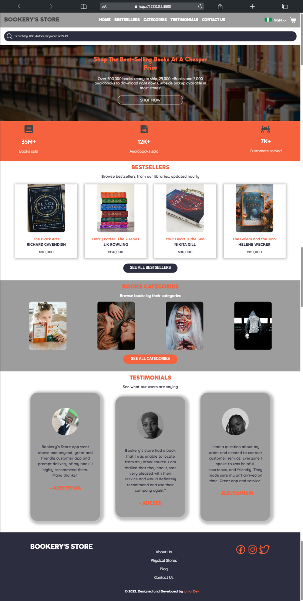

# Bookery's Store App

This is a bookshop ecommerce app, a solution to the [BWJ Frontend Challenge - Intermediate](https://twitter.com/)

## Table of contents

- [Overview](#overview)
  - [The challenge](#the-challenge)
  - [Screenshot](#screenshot)
  - [Links](#links)
- [My process](#my-process)
  - [Built with](#built-with)
  - [What I learned](#what-i-learned)
  - [Continued development](#continued-development)
  - [Useful resources](#useful-resources)
- [Author](#author)
- [Acknowledgments](#acknowledgments)

## Overview

### The challenge

Users should be able to:

- View the optimal layout for the site depending on their device's screen size
- See hover states for all interactive elements on the page

### Screenshot

### Links

- GitHub Repo URL: [Bookery App - GitHub](https://github.com/Manuelcoder02/adefenwa-blogr-landing-page)
- Live Site URL: [Bookery App](https://bookery-app.vercel.app/)
- Figma Design URL: 

## My process

### Built with

- Semantic HTML5 markup
- CSS custom properties
- Flexbox
- CSS Grid
- Mobile-first workflow
- JavaScript

### What I learned

- I learned how to inspect figma files in VS Code
- I dived deep into the var() method in css extensively
- How to use cover an image element with an overlay without affecting the children element
- I learnt about how to position images well in a webpage
- How to use .addEventListener for mouse hovering in JavaScript

### Continued development

- CSS var()
- CSS Keyframes/Animation
- JavaScript DOM / Events handlers

### Useful resources

- [W3 school](https://www.w3schools.com) - This helped me when I was trying to learn more about image opacity, mouseleave, mouseenter etc

- [Chat GPT](https://chat.openai.com/) - It really helped me whenever I'm stuck on a particular section.

## Author

- Frontend Mentor - [Manuelcoder02](https://www.frontendmentor.io/profile/Manuelcoder02)
- Twitter - [juniorDev](https://www.twitter.com/sotundenuel)
- Instagram - [juniorDev](https://www.instagram.com/_junior.dev/)
- Discord - []
- Facebook - [Sotunde Fenwa](https://facebook.com/sotunde.emmanuel.7)
- LinkedIn - [Sotunde Emmanuel](https://www.linkedin.com/in/sotunde-emmanuel)

## Acknowledgments

A big thank you to myself for getting this project done and also Special thanks to [George](https://twitter.com/_Annonnymouss_) for always taking time to review my works.
